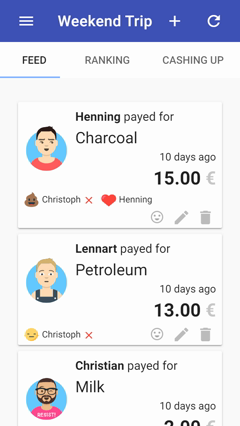
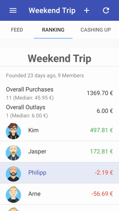
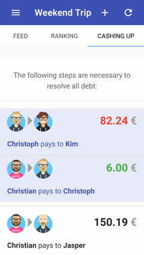
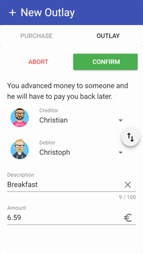

# Payshare

A web app to track shared expenses in a group of people.

Payshare is the equivalent of a whiteboard in the kitchen of your shared flat where everyone writes down how much he paid for groceries, who paid the cinema ticket or pizza for whom and so on, while it does the math for you to figure out who should buy the next round.

## Demo

You can login using the password `demo` [here](https://payshare.cbuelter.de/28d7c6ad-9548-45d6-b023-b8e3b0950a44).

## License

**MIT**, see [LICENSE.txt](LICENSE.txt)

## Screenshots

 

 

## Terminology

- `Collective`: This is basically your shared flat, sports team, whatever
- `User`: A person that can be a member of one or more Collectives
- `Membership`: The connection of a User to a Collective
- ` Purchase`: A User bought something and the cost is shared equally in the Collective
- ` Liquidation` (named "Outlay" in the frontend): Some User gave money to another one and that debt will have to be paid back later

## Development Setup

If you want to setup and run the project yourself, follow these steps (assuming you are on a Unix OS):

#### Backend

- Make sure you have Python 3.x installed
- Clone the project and `cd` into its root directory
- `$ virtualenv venv`
- `$ source venv/bin/activate`
- `$ pip install pip-tools`
- `$ pip-sync`
- `$ python manage.py migrate`
- `$ python manage.py createsuperuser`
- `$ python manage.py runserver`

#### Frontend

Make sure to have ` npm` or ` yarn` installed globally

- `$ cd payshare/purchases/static/client`
- `$ yarn`/ `$ npm install`
- `$ npm run serve`

#### Creating initial Data

The project currently relies on the Django admin pages to create new Collectives and Users and add  Memberships between them.

Assuming your Django dev-server is running at the default port, go to:

https://localhost:8000/admin

- Create a Collective and set a password for it
- Create some Users (`username` is the only field that is displayed. Django requires us to set a password here, but you can just give any, it isn't used)
- Create Memberships for those Users in your Collective

The URL for your collective will be e.g. `http://localhost:8000/<collective-key>`. You can get the key from the admin pages. Send the URL (and the Collective's password of course) to everyone you want to participate, they will be asked to choose a User when logging in for the first time.

You can also assign an avatar for each user by assigning some URL to a hosted image (there is no own upload feature, sorry). You can do that in the ` User profiles` area in the admin pages. There are many avatar generators, I like these:

- https://getavataaars.com/
- http://avatars.adorable.io/
- https://robohash.org/

## A Note about Security

The whiteboard metaphor is valid: Anyone with a "key" to your flat (aka password for the Collective) can create and delete content or impersonate other Users. It's based on trust between the people in the group.

## Tech Stack

Project is build with [Django](https://www.djangoproject.com/) 2.1, [Django-REST-Framework](http://www.django-rest-framework.org/) 3, Vue 2.5, [vue](https://vuejs.org/)-cli-3 and the wonderful [Vuetify](https://vuetifyjs.com/en/) 1.1.0. It is build mainly to be used on a mobile phone, but responsive and very usable on desktop as well. Technically it is a [PWA](https://developers.google.com/web/progressive-web-apps/), but right now that is only used to cache the app shell, not any API responses. Uses SQLite as its database, creating a single file for easy backup.

## Deployment

Oh the joy of deploying custom web apps to your own server. Our backend can be setup as a systemd service that runs a WSGI app via gunicorn, whereas the frontend is built into a bundle of static files that our nginx webserver can serve.

#### Building the Frontend

- `$ cd payshare/purchases/static/client`
- Update the `src/store.js` `apiBaseUrl` as needed, depending where your API lives on.
- `$ npm run build`
- ` $ cd -`
- `$ python manage.py collectstatic --noinput`
- Copy the results from `public` to a folder that your webserver knows, e.g. ` /var/www/payshare`
- Configure your webserver and systemd, see below
- Don't forget to install gunicorn: `$ pip install gunicorn`

Please see the following files for examples on simple systemd and nginx configurations:

- [payshare.service](payshare.service)
- [payshare.conf](payshare.conf)

Notes: We should use https in any case, but it is also a requirement for the service-worker. One specialty about location blocks here is that for some we'll want to pass through the URL path and for others we don't.

#### Image Hosting (e.g. avatars)

You can upload images within the admin page using [Filer](https://django-filer.readthedocs.io/en/latest/index.html)
which is particularly helpful to upload avatars to use within the UserProfile model.
Any URLs that may have been used to create the avatar can be stored in the 'description'
field of the image so it can be used later on.

Images are hosted efficiently by making use of [Whitenoise](http://whitenoise.evans.io/en/stable/),
so there is no need to configure your webserver for it in addition.